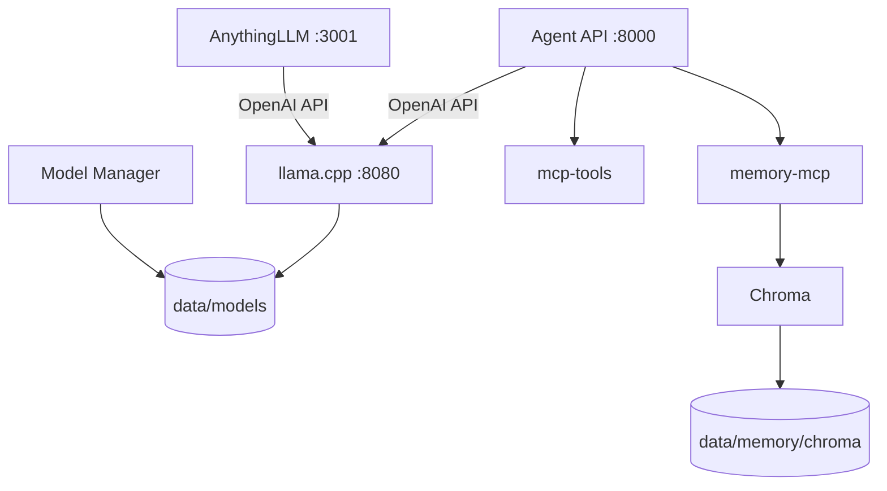

# Local LLM Stack — V1

A local-first, Docker Compose platform with AnythingLLM, one selectable llama.cpp server, safe
Hugging Face GGUF downloads, a FastAPI orchestration foundation, the MCP servers recovered from
`internet.sh`, and persistent Chroma-backed long-term memory.

Prototype V1 serves one selected GGUF model at a time. Model storage, provider interfaces, MCP
boundaries, and service naming are deliberately structured so later versions can add multiple
specialized llama.cpp instances without replacing the control plane.

## V1 status

V1.0.0 has been validated on a CUDA-enabled Linux host.

Validated components include:

- AnythingLLM → llama.cpp conversation
- Agent API `/chat`
- 36 automated tests (`36 passed, 1 deselected`)
- 7 general MCP servers and the Chroma memory MCP
- Real MCP web-scraping invocation through AnythingLLM
- Persistent Chroma memory service
- Docker Compose and NVIDIA CUDA operation

Public release: [v1.0.0](https://github.com/AnkurAlpha/local-llm-stack/releases/tag/v1.0.0)

## Architecture



All containers share `local-llm-network` (or the name derived from
`COMPOSE_PROJECT_NAME`). Container-to-container traffic uses Docker DNS names, never host
`localhost`. Only these host loopback ports are published:

| Host URL | Service |
| --- | --- |
| `http://localhost:3001` | AnythingLLM |
| `http://localhost:8080/v1` | llama.cpp OpenAI-compatible API |
| `http://localhost:8000` | Agent API |

Chroma and all MCP ports remain Docker-internal.

## Requirements

- Linux
- Python 3 (used only by the host-side `llmctl` helper)
- Docker Engine
- Docker Compose v2.30 or later
- CUDA mode: an NVIDIA GPU, a compatible NVIDIA driver, and NVIDIA Container Toolkit
- Enough disk space for the selected GGUF plus a small safety reserve

Run the built-in preflight after creating `.env`:

```bash
./llmctl doctor
```

It checks Docker access and, in CUDA mode, performs a real throwaway NVIDIA-container GPU probe.

## First launch

```bash
cp .env.example .env
./llmctl up
```

The example assumes your Linux user/group IDs are `1000:1000`. If `id -u` or `id -g` reports a
different value, set `HOST_UID`, `HOST_GID`, `ANYTHINGLLM_UID`, and `ANYTHINGLLM_GID` in `.env`
before the first start so bind-mounted files remain writable by your user.

`./llmctl up` is equivalent to building and starting the whole stack, with additional checks for
ports, Docker, Compose, and CUDA. It is safe to start before downloading a model: llama.cpp reports
`WAITING`, while AnythingLLM, Agent API, the model manager, MCP tools, memory MCP, and Chroma remain
up.

Raw Compose also works because `.env.example` sets both Compose files for CUDA:

```bash
docker compose up -d --build
```

No production model is downloaded merely by starting the stack.

## Download and select a model

```bash
./llmctl download unsloth/Qwen3-8B-GGUF
```

The default pattern is configured in `.env`:

```dotenv
DEFAULT_GGUF_PATTERN=*Q4_K_M*.gguf
```

Override it for one download:

```bash
./llmctl download unsloth/Qwen3-8B-GGUF --pattern "*Q5_K_M*.gguf"
```

The manager queries repository metadata first. It excludes auxiliary `mmproj` files, groups a
complete sharded GGUF set as one choice, and refuses to download if more than one quantization still
matches. It never falls back to downloading every GGUF in a repository.

Downloads use aria2 with eight resumable connections by default. Data first lands as
`*.gguf.partial`; only a file with the expected size, valid GGUF magic, and (when Hugging Face
provides it) a passing SHA-256 checksum is atomically promoted. `huggingface_hub` is the resumable
fallback for URLs aria2 should not handle. Interrupted partial files remain for the next run.

List and activate a completed model:

```bash
./llmctl models
./llmctl use Qwen3-8B-Q4_K_M.gguf
```

`use` accepts an exact model ID, repository ID, primary filename, or one unique substring. It writes
`data/state/current-model.json`, restarts only llama.cpp, waits for the real health endpoint, and
prints the active model. The stable API alias is `local-model`, so AnythingLLM does not require a
provider edit after every model switch.

Other model commands:

```bash
./llmctl current
./llmctl inspect MODEL
./llmctl remove MODEL
```

Removal asks for confirmation and refuses to delete a healthy currently selected model. If its
files were already deleted or corrupted outside `llmctl`, removal clears that stale selection,
removes the broken registry entry, and returns llama.cpp to `WAITING`.

### Gated Hugging Face repositories

Accept the repository terms in Hugging Face, create a read token, then put it only in your local
`.env`:

```dotenv
HF_TOKEN=hf_your_token_here
```

`.env` is ignored by Git. The token is passed only to `model-manager`, is not printed, and is not
placed in committed configuration.

### Optional explicit bootstrap

Bootstrap is disabled by default. To intentionally download at first model-manager startup, set:

```dotenv
BOOTSTRAP_MODEL_REPO=owner/repository
BOOTSTRAP_MODEL_PATTERN=*Q4_K_M*.gguf
```

Use this only after checking the repository and expected size.

## AnythingLLM

Open [http://localhost:3001](http://localhost:3001). The container receives these safe defaults:

- provider: `generic-openai`
- base URL: `http://llama-cpp:8080/v1`
- model: `local-model`
- token limit: `LLAMA_CONTEXT_SIZE`
- local placeholder API key: `local-no-key-required`

AnythingLLM may still show its normal first-run setup screen. If the environment defaults are not
adopted by that release, perform this one-time UI step:

1. Open **Settings → AI Providers → LLM**.
2. Select **Generic OpenAI**.
3. Enter `http://llama-cpp:8080/v1` as the base URL.
4. Enter `local-model` as the model and `local-no-key-required` as the key.
5. Set the token limit to the value of `LLAMA_CONTEXT_SIZE` and save.

Keep AnythingLLM's native embedder unless you deliberately load an embedding-capable model. The
llama.cpp chat model is not assumed to provide embeddings.

AnythingLLM reads its MCP file from
`data/anythingllm/plugins/anythingllm_mcp_servers.json`; Compose mounts the generated configuration
there. The MCP management screen can display server status and available tools. The canonical
source remains `config/mcp/servers.json`; run `python3 scripts/generate_mcp_configs.py` after an
intentional manifest change.

## MCP services from the supplied scripts

The following list is taken exactly from `internet.sh` and `mcp_setup.sh`. Packages are installed at
image-build time instead of being fetched by `npx -y` or `uvx` on every startup.

| MCP | Container | Original transport | Container transport | Internal endpoint |
| --- | --- | --- | --- | --- |
| DuckDuckGo | `mcp-tools` | Streamable HTTP | Streamable HTTP | `http://mcp-tools:8000/mcp` |
| Sequential Thinking | `mcp-tools` | stdio | Streamable HTTP bridge | `http://mcp-tools:8003/mcp` |
| Fetch | `mcp-tools` | stdio | Streamable HTTP bridge | `http://mcp-tools:8004/mcp` |
| Time | `mcp-tools` | stdio | Streamable HTTP bridge | `http://mcp-tools:8005/mcp` |
| SQLite | `mcp-tools` | stdio | Streamable HTTP bridge | `http://mcp-tools:8006/mcp` |
| Context7 | `mcp-tools` | stdio | Streamable HTTP bridge | `http://mcp-tools:8007/mcp` |
| Playwright | `mcp-tools` | stdio | Streamable HTTP bridge | `http://mcp-tools:8931/mcp` |
| Chroma Memory | `memory-mcp` | stdio | Streamable HTTP bridge | `http://memory-mcp:8011/mcp` |

General MCP runtime files remain ephemeral, matching the old script's temporary runtime directory.
The persistent memory MCP is completely separate and retains the supplied tools:

- `remember_memory`
- `search_memory`
- `delete_memory`
- `update_memory`
- `list_recent_memories`

Inspect them with:

```bash
./llmctl mcp list
./llmctl mcp status
./llmctl mcp logs
./llmctl memory status
./llmctl memory logs
```

The Agent API can discover MCP services at `GET /mcp/services` and query a live service's SDK tool
list at `GET /mcp/services/{name}/tools`. Future agents should depend on this abstraction rather than
embedding endpoint URLs.

## Persistent Chroma memory

Chroma uses the original pinned `chromadb/chroma:1.5.3` image and the internal URL
`http://chroma:8000`. Its `/data` directory is bind-mounted at:

```text
data/memory/chroma/
```

That directory survives container restarts, `docker compose down`, image rebuilds, container
recreation, and host reboot. Do not run `docker compose down -v` when handling unrelated stacks,
although this project uses a bind mount rather than a named volume.

Create a consistent, timestamped backup (the command briefly stops only the memory services):

```bash
./llmctl memory backup
```

Backups are stored under `data/backups/` and ignored by Git.

### Import old named-volume memory

The old script created names such as
`chroma-memory-volume-gemma4-26b-a4b-it-qat-q4_0`. Import one non-destructively while the destination
is empty:

```bash
./llmctl memory import-volume chroma-memory-volume-gemma4-26b-a4b-it-qat-q4_0
```

The command stops memory services, copies from the source volume read-only, retains the original
volume, restarts the services, and creates a timestamped backup. It refuses to overwrite existing
bind-mounted memory. Chroma data formats must match the pinned 1.5.3 image; if the old volume used a
different version, back it up and test migration with that exact version first.

The matching Python `chromadb==1.5.3` client release is yanked on PyPI but remains installable by
an exact pin. V1 intentionally retains it because the supplied setup and existing data use 1.5.3;
upgrade the server, client, and a verified backup together rather than changing only one side.

## Agent API

Useful endpoints:

```text
GET  /health
GET  /models
GET  /models/current
POST /chat
GET  /mcp/services
GET  /mcp/services/{name}/tools
```

Example:

```bash
curl -sS http://localhost:8000/chat \
  -H 'Content-Type: application/json' \
  -d '{"messages":[{"role":"user","content":"Say hello in one sentence."}]}'
```

The FastAPI code isolates inference behind `ChatProvider` and MCP behind `MCPClient`. Empty
`agents/` and `tools/` extension packages document where the later router, planner, research,
mathematics, coding, testing, build, document, and internet-search components belong.

## Storage layout

```text
data/
├── models/                 # owner/repository/*.gguf and resumable partials
├── state/                  # models.json, current-model.json, launcher status
├── anythingllm/            # AnythingLLM application state
├── memory/chroma/          # long-term Chroma database
└── backups/                # explicit Chroma backup archives
```

Model metadata records the source repository, filenames/shards, sizes, UTC download time, resolved
revision/commit, selection pattern, and completion state. Model weights, partials, application state,
Chroma data, tokens, and backups are ignored by Git.

## CPU mode

CUDA is the default. To use the already-supported CPU architecture later, edit `.env`:

```dotenv
COMPOSE_FILE=compose.yml
LLAMA_ACCELERATOR=cpu
LLAMA_CPP_BASE_IMAGE=ghcr.io/ggml-org/llama.cpp:server-b10362
LLAMA_GPU_LAYERS=0
LLAMA_FLASH_ATTN=off
```

Then rebuild only the launcher image:

```bash
./llmctl up
```

## Operations

```bash
./llmctl status
./llmctl logs
./llmctl logs llama-cpp
./llmctl restart
./llmctl shell agent-api
./llmctl down
```

`down` never removes persistent data.

## Troubleshooting

### Docker or Compose unavailable

Run `./llmctl doctor`. Ensure Docker is running and that your user can run `docker info` without
`sudo`. Log out/in after adding yourself to the `docker` group.

### NVIDIA Container Toolkit / GPU failure

Both host `nvidia-smi` and `docker run --gpus all ... nvidia-smi` must work. Install NVIDIA Container
Toolkit for your distribution, configure the Docker runtime, restart Docker, then rerun
`./llmctl doctor`. If the pinned CUDA image requires a newer driver, update the driver or deliberately
pin a compatible official llama.cpp CUDA build.

### llama.cpp stays in ERROR

```bash
./llmctl current
./llmctl inspect MODEL
./llmctl logs llama-cpp
```

Typical causes are a model larger than available RAM/VRAM, an incompatible GGUF, invalid custom
`LLAMA_EXTRA_ARGS`, or deleting/moving a selected file outside `llmctl`. Lower context/batch sizes or
GPU layers in `.env`, then restart.

### Ambiguous/no GGUF match

The error prints every safe choice. Retry with a quantization-specific `--pattern`. If the repository
has only safetensors or incomplete shards, choose a real GGUF repository.

### Interrupted download

Repeat the same `./llmctl download` command. aria2 resumes its `.partial` file. Do not rename partials
to `.gguf`.

### Port already in use

`llmctl up` checks 3001, 8080, and 8000 before a first start. Stop the conflicting program or change
`ANYTHINGLLM_PORT`, `LLAMA_PORT`, or `AGENT_PORT` in `.env`. Internal service ports and DNS names do
not change.

### AnythingLLM MCP changes do not appear

Run:

```bash
python3 scripts/generate_mcp_configs.py
./llmctl restart anythingllm
```

Then use AnythingLLM's MCP management screen to reload the configuration.

## Development and tests

```bash
python3 -m venv .venv
.venv/bin/pip install -r requirements-dev.txt
.venv/bin/ruff check .
.venv/bin/ruff format --check .
.venv/bin/pytest
docker compose config
docker compose build model-manager agent-api mcp-tools memory-mcp llama-cpp
```

The opt-in metadata-only Hugging Face test downloads no model weights:

```bash
.venv/bin/pytest -m live tests/live/test_hf_metadata_live.py
```

See [docs/ARCHITECTURE.md](docs/ARCHITECTURE.md) and
[docs/MCP_MIGRATION.md](docs/MCP_MIGRATION.md) for extension boundaries and the exact migration from
the supplied scripts. [docs/VALIDATION.md](docs/VALIDATION.md) records authoring-environment and
target-host validation results.
