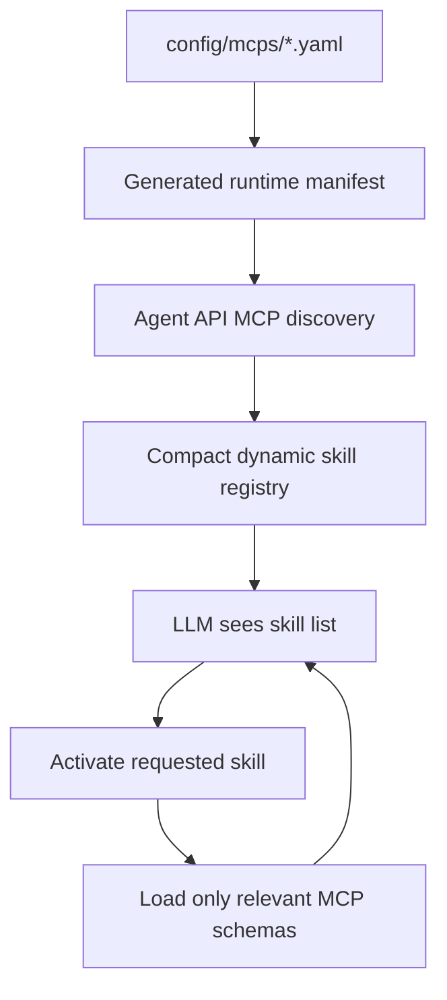

# LMCTL V2: Dynamic MCP skills

V2 keeps the V1 Compose services, model storage, AnythingLLM integration,
llama.cpp integration, health checks, and separate Chroma memory service. The
new layer changes how the Agent API exposes MCP capabilities to the model.

## MCP versus skill

An MCP is an executable protocol server. It defines the actual tools and JSON
input schemas. A skill is the small model-facing description of when a
capability is useful. Auto-generated skills describe MCP capabilities; manual
skills describe behavior and workflows.



## Startup discovery

`./llmctl up` regenerates the runtime manifest from `config/mcps/*.yaml`.
The Agent API initializes each enabled MCP and calls `tools/list`. A failed
server is recorded as `unavailable`; other servers continue to load. The
runtime snapshot is written to `data/mcp/discovery.json`.

The generated manifest contains endpoints and launch information, not tool
schemas. The MCP server remains the source of truth for tool names,
descriptions, and input schemas.

## Progressive loading

The initial OpenAI-compatible request to `/v1/chat/completions` contains a
compact skill prompt and one small `lmctl_activate_skill` function. It does not
contain all discovered schemas. After the model activates a skill, the Agent
API adds the relevant namespaced tools, for example:

```text
mcp__duckduckgo__search
mcp__fetch__fetch
```

The Agent API executes the MCP call, returns its result to the model, and
continues the normal tool loop. The response includes an `lmctl` diagnostic
object with active skills, loaded tools, and approximate schema sizes.

The streaming gateway also emits a bounded activity trace containing skill
activation, loaded tools, actual MCP calls, completion/failure, and final
response-generation events. See
[V2_ACTIVITY_STREAM.md](V2_ACTIVITY_STREAM.md). This trace describes agent
operations and does not expose private model chain-of-thought.

## Adding an MCP

For an MCP inside the existing `mcp-tools` container:

1. Install/pin its package in `services/mcp-tools/Dockerfile`.
2. Add one YAML definition in `config/mcps/`.
3. Run `./llmctl up` (or `python3 scripts/generate_mcp_configs.py`).

For an MCP in another container, use `runtime.mode: external`, set its
Docker-DNS endpoint, and add the service to Compose separately. The supervisor
will not launch external entries, but Agent API discovery will still inspect
them.

Do not copy its tool schemas into YAML or into a prompt.

## Manual behavioral skills

Add a Markdown file under `config/skills/`:

```markdown
---
id: deep-research
description: Produce careful, source-grounded research.
capability: internet
---

Behavioral instructions go here.
```

The description is visible initially. The full instructions are returned only
after activation. `capability` is optional; when present, its auto-discovered
MCP tools are loaded with the behavioral instructions.

## Persistent memory

The Chroma-backed memory MCP remains a separate `memory-mcp` service and keeps
its persistent bind mount at `data/memory/chroma`. Its actual tools are still
discovered over MCP. The `persistent-memory` manual skill supplies policy for
when to search, store, update, and delete memories.

Do not use `docker compose down -v` for routine shutdown. Use the existing
memory backup/import commands.

## Observability and context metrics

With the stack running:

```bash
./llmctl mcp status
./llmctl mcp refresh
./llmctl skills
./llmctl skills show internet
./llmctl tools
./llmctl tools active
./llmctl activity
```

The same information is available from the Agent API:

```text
GET  /mcp/status
GET  /mcp/discovery
POST /mcp/refresh
GET  /mcp/capabilities
GET  /mcp/skills
GET  /mcp/tools
GET  /mcp/tools/active
GET  /mcp/activity
```

Compare `all_tool_schema_approx_tokens` with
`compact_skill_prompt_approx_tokens` and the active-tool metrics in a chat
response. The exact token count depends on the tokenizer; the reported values
are deliberately approximate character-based estimates.

## Troubleshooting

1. Run `./llmctl mcp status` and inspect the Agent API discovery section.
2. Run `./llmctl mcp logs` for the general MCP supervisor.
3. Run `./llmctl memory logs` for Chroma-backed memory.
4. Confirm the endpoint uses Docker DNS, not `localhost`.
5. Confirm the MCP's package/command is installed in the image.
6. After changing YAML or installing a server, run `./llmctl mcp refresh` or
   restart the stack.

V1 direct AnythingLLM MCP configuration is still generated at
`config/mcp/anythingllm_mcp_servers.json`. V2's default native AnythingLLM
configuration is the empty `anythingllm_mcp_servers_v2.json`; the Agent API is
the progressive-loading gateway.
